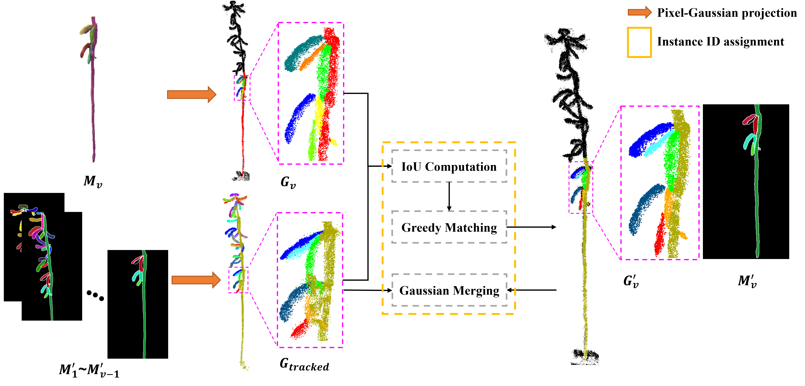

# SoybeanInsGS: A high-precision and data-efficient point cloud instance segmentation pipeline for mature soybean plants via cross-view instance tracking and instance-aware 3D Gaussian Splatting 

## Methods

### Overview
The proposed soybean instance-aware 3D Gaussian Splatting (SoybeanInsGS) pipeline follows a structured workflow, as illustrated in Fig. 1. Collected multi-view RGB images are simultaneously utilized for 2D instance segmentation (Fig. 1a) as well as 3D Gaussian Splatting (3DGS) reconstruction (Fig. 1b). Specifically, 2D instance segmentation is performed via the Roboflow Detection Transformer (RF-DETR) model to generate fine-grained masks for pods and stems. Furthermore, 3DGS reconstruction uses camera poses and a sparse point cloud generated from COLMAP (Schönberger and Frahm, 2016) to establish a high-fidelity 3DGS model. To ensure instance identification (ID) consistency across views, cross-view instance tracking (CVIT) algorithm is employed to assign cross-view consistent instance IDs by projecting 2D instance masks into the 3D space to group them with corresponding 3D Gaussians (Fig. 1c). Subsequently, the proposed instance-aware 3D Gaussian Splatting (IGS) method augments the 3D Gaussians with instance-aware features and optimizes them through supervised alignment and contrastive learning between rendered feature maps and the consistent masks, followed by the application of the Hierarchical Density Based Spatial Clustering of Applications with Noise (HDBSCAN) (Campello et al., 2013) clustering algorithm to the instance-aware 3D Gaussians to achieve accurate point cloud instance segmentation (Fig. 1d). Finally, key phenotypic traits, including pod number, plant height, pod length, and pod width, are extracted and quantitatively evaluated from the segmented point clouds.


Figure 1: The proposed soybean instance-aware 3D Gaussian Splatting (SoybeanInsGS) pipeline.

### CVIT: Cross-view Instance Tracking
We propose a novel cross-view instance tracking (CVIT) method to track the same instance across different views, which is the key to achieving high-precision and data-efficient point cloud instance segmentation for mature soybean plants.



Figure 2: The proposed cross-view instance tracking (CVIT) method.

## Results
### Rendered Images


Figure 3: The rendered images of cross-view consistent instance masks of the soybean plants.

### Cross-view Instance Tracking


Figure 4: The cross-view instance tracking results of the soybean plants.

### Point Cloud Instance Segmentation


Figure 5: The point cloud instance segmentation results of the soybean plants.

## Installation
```shell
conda create --name soybeaninsgs -y python=3.10
conda activate soybeaninsgs
pip install torch==2.2.2 torchvision==0.17.2 --index-url https://download.pytorch.org/whl/cu118
pip install rfdetr

pip install plyfile==0.8.1
pip install tqdm scipy wandb opencv-python scikit-learn lpips hdbscan dearpygui
pip install "numpy<2"

pip install submodules/diff-gaussian-rasterization --no-build-isolation
pip install submodules/simple-knn --no-build-isolation
```

## Data Preparation:
We typically support data prepared as COLMAP format.


```
data/
├── scene_1                     # scene_1, scene_2, ... are different scenes (different soybean plants)
│   ├── images                  # images, images_2, images_4, and images_8 are the original images with different downsampling rates (1, 2, 4, and 8)
│   ├── images_2
│   ├── images_4
│   ├── images_8
│   ├── object_mask             # cross-view instance tracking results(gray), which are used as the supervision for training the instance-aware 3D Gaussian Splatting model
│   ├── rf_detr_mask            # cross-view instance tracking results(gray), for backup
│   ├── rf_detr_mask_visual     # cross-view instance tracking results(visual), which are used for visualization
│   ├── raw_rf_detr_mask        # RF-DETR results(gray), for cross-view instance tracking
│   └── sparse                  # COLMAP results
├── scene_2
│   ├── images
│   ├── images_2
│   ├── images_4
│   ├── images_8
│   ├── object_mask
│   ├── rf_detr_mask
│   ├── rf_detr_mask_visual
│   ├── raw_rf_detr_mask
│   └── sparse
├── ...

```